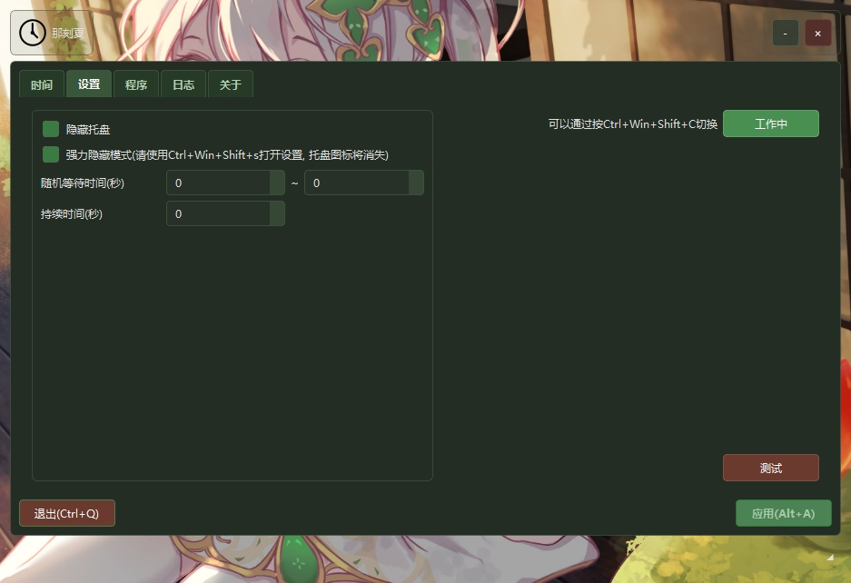
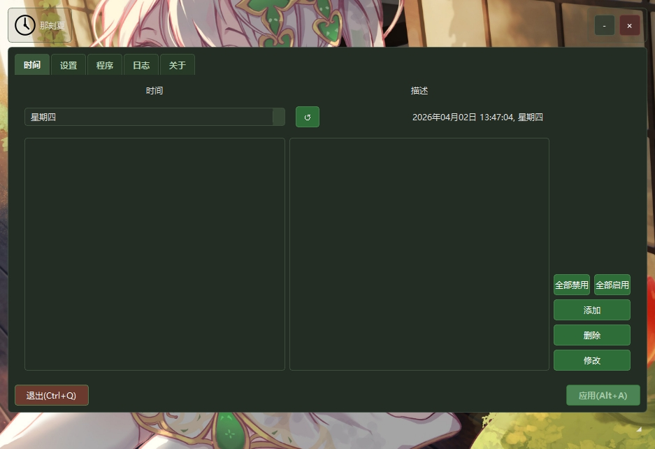
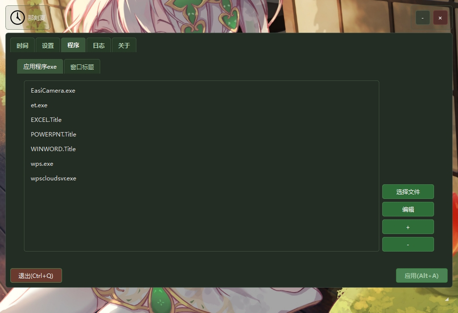
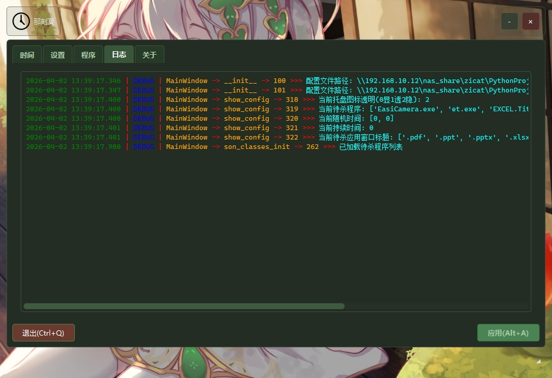

<div align="center">


 [](https://github.com/ZYOctopuszy/TimeTipper/releases/latest) [](https://github.com/ZYOctopuszy/TimeTipper/releases) [](https://github.com/ZYOctopuszy/TimeTipper/blob/main/LICENSE)

</div>

# TimeTipper
#### ***乱用小心被老师\*\*!***

## 🌐 关于
这是一个初三的学生花费几个月利用`Python`+`PySide6`写的小程序,  
主要是为了防止老师拖堂...

## 🚀  使用
前往[releases](https://github.com/ZYOctopuszy/TimeTipper/releases)页面直接下载最新版本即可  
单文件exe, 双击直接运行

## 👦 作者
- [ZYOctopuszy@Github](https://www.github.com/ZYOctopuszy)

## 💬 反馈
如果你有任何反馈，请联系我：[Z_Octopus@outlook.com](mailto:Z_Octopus@outlook.com)

## 📖 教程

第一次运行时,程序会自动在程序所在目录创建两个配置文件`clock.json`和`config.json`,
它们的内容分别是**下课时间及其描述**和**软件的一些基本设置**

第一次运行时, 你会在任务栏里看到一个时钟的图标, ***双击***它就可以打开软件的设置界面.  
***右键***它还有一些选项; ***中键***点击就会退出软件

当勾选"**隐藏托盘**"选项时,任务栏里的时钟图标会变成透明图片,
需要按住**shift**双击透明图标并在第二次点击前按下**Esc**键才能打开软件设置界面(或者右键图标选择第一个选项)  
当勾选"**强力隐藏模式**"时,任务栏将会***直接隐藏软件图标***, 
届时只能通过全局快捷键打开设置界面.  

在时间设置界面(如下图)

你可以设置每一天的时间, 右键时间点可以切换它的启用状态, 星期右边的**刷新**按钮可以快速切换到当日

在添加程序界面(如下图)

你可以添加下课时需要关闭的**程序**(**完整exe名, 带后缀**)和**窗口**(**取其标题的一部分即可, 会模糊匹配所有标题含有该字段的窗口并关闭**)

日志界面(如下图)

你可以查看软件运行时的所有日志, 包括**下课时间**, **关闭的程序**, **关闭的窗口**等

软件运行关键逻辑(在没有催眠那刻夏的前提下):
- while 软件运行时
  - 反复检测当前时间是否是设置的下课时间(间隔0.01秒)
  - 如果是: 执行清剿
    - 获取所有窗口标题, 如果包含设置的窗口标题内容, 就对其发送关闭事件
    - 利用window自带的tasklist命令检测当前有没有运行着的上课软件, 有则taskkill之
  - 不是的话无事发生

## 🔧 配置文件
- `clock.json`
  - 包含下课时间及其描述
  - 格式:(一共有7个列表, 每个列表包含一周**每天**的**时间点**信息, 
  - 以列表形式保存, 列表中第0, 1, 2个索引分别是时间, 描述, 启用状态)
    ```json
    
    {
      "config": [
          [],
          [],
          [],
          [],
          [],
          [
            [
                "00:00",
                "Default Description",
                true
            ]
          ],
          []
      ]
    }
    
    ```
- `config.json`
  - 包含软件的一些基本设置
  - 格式:(hide_tray的数值为0, 1, 2, 分别对应"不隐藏", "普通隐藏", "强力隐藏")
    ```json

    {
      "hide_tray": 2,
      "forKillExe": [
          "EasiCamera.exe",
          "et.exe",
          "EXCEL.Title",
          "POWERPNT.Title",
          "WINWORD.Title",
          "wps.exe",
          "wpscloudsvr.exe"
      ],
      "random_time": [
          0,
          30
      ],
      "hold_time": 300,
      "forKillWindowTitle": [
          ".pdf",
          ".ppt",
          ".pptx",
          ".xlsx",
          "192.168.",
          "\u5206\u4eab\u7684\u56fe\u7247",
          "\u804a\u5929\u8bb0\u5f55",
          "\u6587\u6863\u6587\u4ef6"
      ]
    }
    ```

## 👨‍💻 开发
- 本项目使用`Python`编程语言开发
- 要求环境:
  - `Python 3.13`及以上
  - `Windows 10`及以上
  - 使用`Git`进行版本管理

1. 📥克隆项目:
    ```bash
    git clone https://github.com/ZYOctopuszy/TimeTipper.git
    ```
2. 安装依赖
    ```bash
    pip install -r requirements.txt
    ```
- 📚依赖库:
  - `loguru`
  - `PySide6`
  - `pywin32`
  - `keyboard`
  - `Nuitka`
  - `psutil`
- ⚙️构建:
  `enter_venv.bat && packed_by_nuitka.bat`


## ⭐ 支持
- 如果您觉得本项目还不错, 不妨点个免费的⭐Star~

Star趋势图
[](https://starchart.cc/ZYOctopuszy/TimeTipper)

## ❤️ 感谢贡献

<a href="https://github.com/ZYOctopuszy/TimeTipper/graphs/contributors">
   
</a>